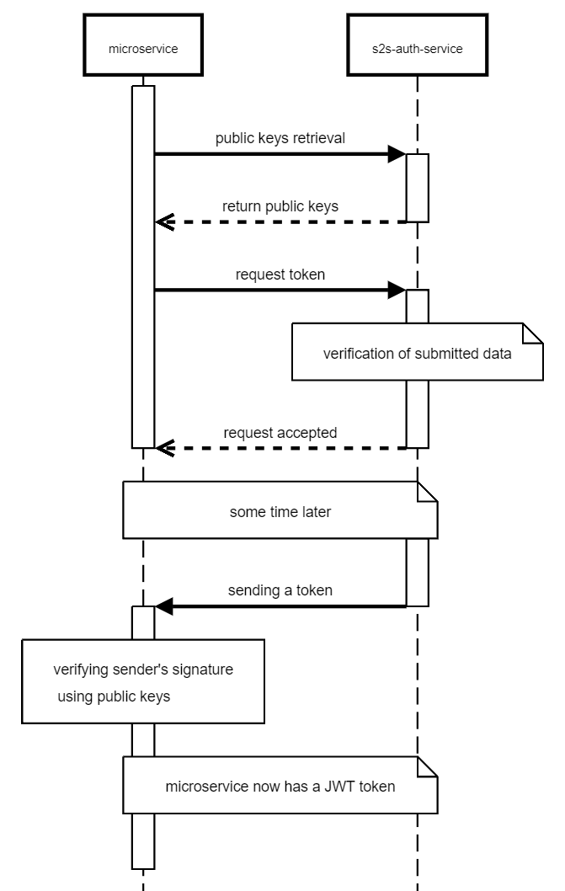
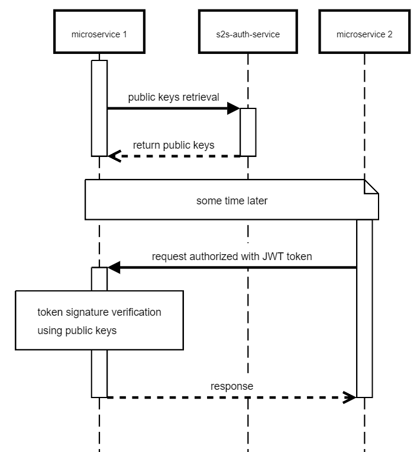
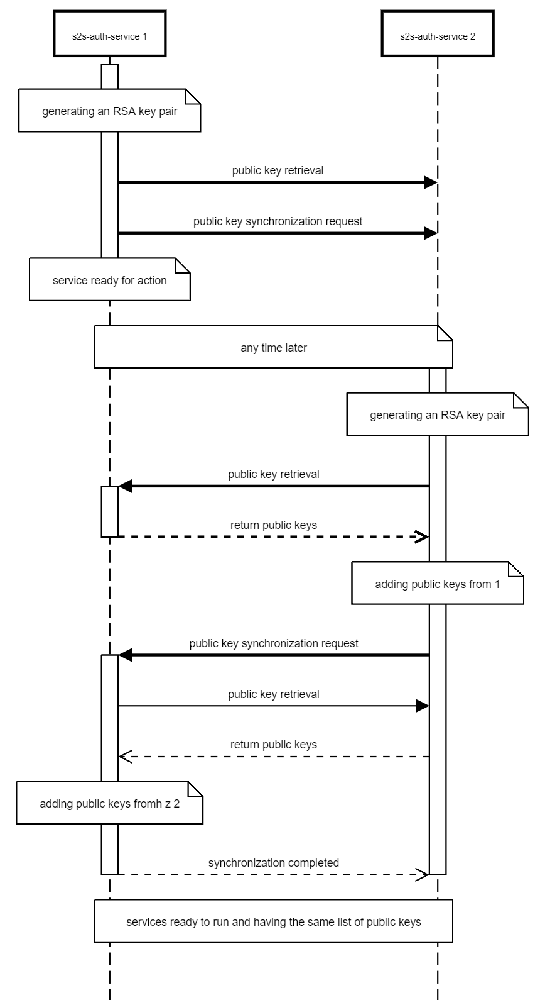
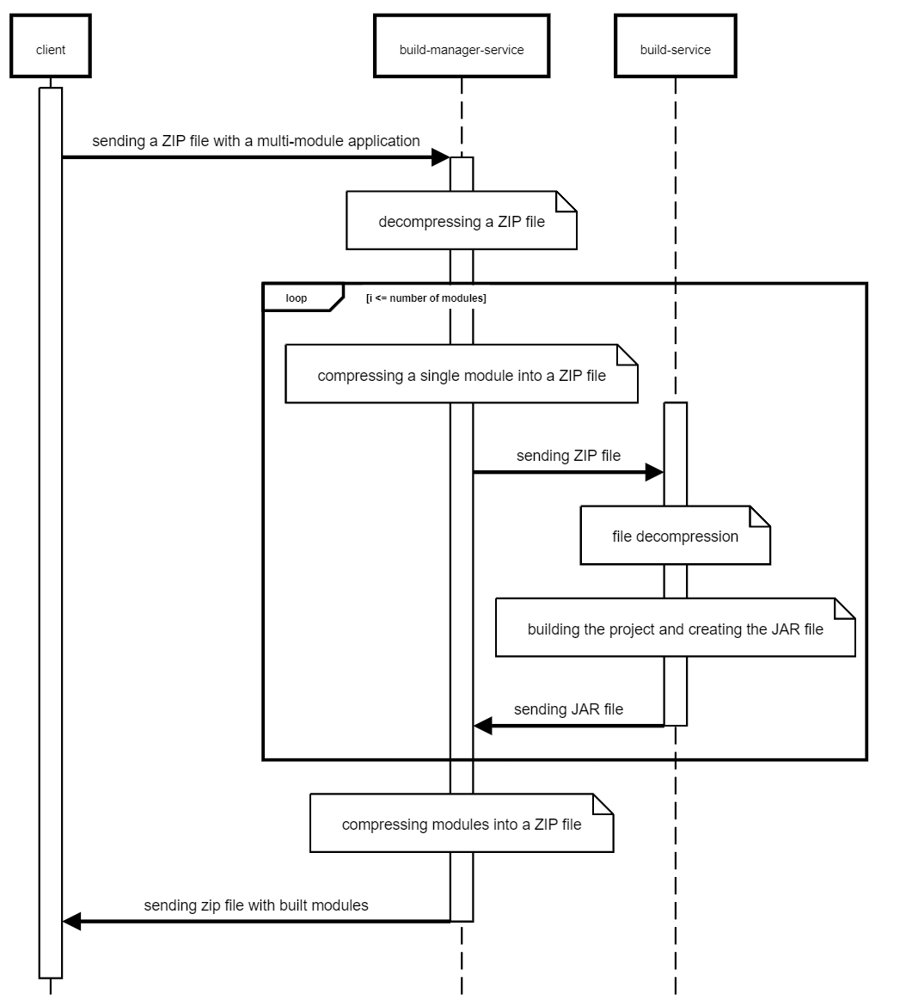

# About application

The [s2s-auth-service](https://github.com/MateuszSapala/s2s-auth-service) application aims to provide an easy
authentication process between services in a microservice environment. It simplifies the work of developers by offering
a simple and stable solution that can be implemented in any microservice.

The application uses asymmetric encryption keys in its operation, using RSA keys by default, although it is easy to
change them to another type of asymmetric keys. After starting, the service generates a pair of RSA keys, the public key
of which is available for download via REST API. Other microservices can use this interface to request a JWT token
signed by the private key. The token is sent asynchronously to the URL passed in the request body, which should lead to
the requesting service.

Authentication is done by validating the URLs to which tokens can be sent. If an unspecified URL is provided in the
configuration, the token will not be sent there. For validation to be secure, applications should use the HTTPS
protocol. This protocol encrypts the transmitted data using the TSL protocol so that the transmitted data is protected.
Using HTTP allows unauthorized persons to intercept the data, because it is sent in plain text.

The application using the system, after receiving the token, can add it to the "Authorization" query header, which will
then be downloaded by the queried microservice and checked there. Verification of whether a given JWT token is valid is
done using public keys to validate the token signature.

# Library s2s-auth-service-api

The [s2s-auth-service-api](https://github.com/MateuszSapala/s2s-auth-service-api) library was created for the
application, with the aim of facilitating communication
with [s2s-auth-service](https://github.com/MateuszSapala/s2s-auth-service) and minimizing the need to write repetitive
code. The module automates the downloading and refreshing of public keys. It also makes it easier to obtain tokens for
authentication between services, also called service-to-service tokens. Public keys are re-downloaded every hour,
although this may happen earlier if the received JWT token is issued for a key that was not yet available. JWT tokens
are refreshed after half the validity period of the previous token, e.g.
if [s2s-auth-service](https://github.com/MateuszSapala/s2s-auth-service) issues a token valid for an hour, the library
will refresh it after half an hour. The module also provides a query filter that can be easily added to applications
using Spring Security. The filter allows you to limit access} to a given endpoint to only authorized services. The
filter uses a custom "Authenticated" annotation which, when used over an endpoint, will restrict access to it. The
annotation will only allow access to those services that are defined in the annotation.

# Sequence diagrams

The processes of token retrieval, verification and key synchronization in
the [s2s-auth-service](https://github.com/MateuszSapala/s2s-auth-service) system will now be presented using sequence
diagrams.

The diagrams were created using [https://sequencediagram.org](https://sequencediagram.org).

## Token retrieval

The following figure shows a sequence diagram that shows the interaction between an example microservice and
the [s2s-auth-service](https://github.com/MateuszSapala/s2s-auth-service) application, where the service obtains a token
used to authenticate in other services. The microservice starts by downloading public keys, and then requests a token
from [s2s-auth-service](https://github.com/MateuszSapala/s2s-auth-service), specifying in the query body the URL to
which the token should be sent. The JWT is sent in a separate query to the specified URL. The microservice, upon
receiving the token, checks the correctness of the received data, by verifying the token. The JWT is verified by
checking the signature, using previously downloaded public keys.

## Token verification

The figure below shows a sequence diagram showing the interaction between two microservices, the first of which is
queried by the second, which uses the service-to-service token for authentication. The activity starts with downloading
public keys from [s2s-auth-service](https://github.com/MateuszSapala/s2s-auth-service) when the first application
starts. Then the second service sends a request to the second one, in which the JWT token is included in the "
Authorization" header. The first application, receiving the request, checks the token by verifying its signature, using
the previously downloaded public keys. If authentication was successful, the first service returns a positive response.

## Public keys synchronization

The figure below shows a sequence diagram showing the interaction between two instances of
the [s2s-auth-service](https://github.com/MateuszSapala/s2s-auth-service) application, in which the services synchronize
public keys. The process takes place to enable two or more instances of the application to run simultaneously, which
ensures high availability of the service, assuming that all application instances will be available via the load
balancer.

Synchronization starts with the launch of the first service, which generates a pair of RSA keys. Then the application
tries to get the public keys and request public key synchronization in the second instance, but both requests fail
because the second instance is not ready to accept requests. The first instance of the service is now ready to run and
can receive requests from other services.

The second application then starts and generates an RSA key pair, then gets the public keys from the first instance,
which are then added to the stored keys. Then the second service requests public key synchronization in the first, which
gets them from the second and adds them to the stored keys. At this point, the synchronization process is complete and
both applications have the same list of keys.

# Example usage

Two sample applications have also been
written: [build-manager-service](https://github.com/MateuszSapala/build-manager-service)
and [build-service](https://github.com/MateuszSapala/build-service), which constitute a distributed build system. These
services will serve as a demonstration of how in Spring, using
the [s2s-auth-service-api](https://github.com/MateuszSapala/s2s-auth-service-api) library, service-to-service
authentication can be easily implemented using the [s2s-auth-service](https://github.com/MateuszSapala/s2s-auth-service)
service.

[build-manager-service](https://github.com/MateuszSapala/build-manager-service) is an application used to build
multi-module applications using Maven. The service contains an endpoint that accepts a ZIP archive with a multi-module
application and then returns a ZIP containing the built JAR files. The application does not build the entire project
directly, but divides it into modules, which it prepares accordingly. Each module is then built in a separate coroutine.
The build task is not executed by [build-manager-service](https://github.com/MateuszSapala/build-manager-service), but
is passed to [build-service](https://github.com/MateuszSapala/build-service) via HTTP API.

[build-service](https://github.com/MateuszSapala/build-service) receives build requests, which after execution return
JAR files. The communication between applications involves nginx ([nginx.conf](nginx.conf)), which acts as a load
balancer that distributes traffic across multiple instances of the module build service. With nginx, each instance of
the [build-service](https://github.com/MateuszSapala/build-service) can be located on a separate server. If the system
were distributed across multiple servers, it would have a distributed architecture. In this case, this architecture
would make projects build faster because they could use more servers and their resources.

The figure below shows a sequence diagram illustrating the build process in the distributed system in question.

